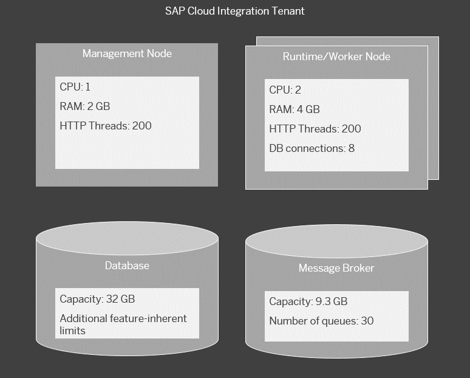

<!-- loiof8cf97498d2549daab65db34f11e119d -->

# Run an Integration Flow Under Well-Defined Boundary Conditions

Developing enterprise-grade integration flows mandates the diligent management of the resources available on the customer tenant. Depending on the capabilities used in the integration flow, SAP Cloud Integration relies on the computing system, database persistence, and messaging service broker to process messages.

> ### Note:  
> You can find the example integration flows that illustrate the guidelines explained in this section in the following integration package published on SAP Business Accelerator Hub:
> 
> [Integration Flow Design Guidelines - Run an Integration Flow Under Well-Defined Boundary Conditions](https://api.sap.com/package/DesignGuidelinesManageResources?section=Overview)
> 
> For more information, see [Copying the Integration Package and Deploying the Integration Flows](copying-the-integration-package-and-deploying-the-integration-flows-2cb1d31.md).

> ### Note:  
> For more information, see [Copying the Integration Package and Deploying the Integration Flows](copying-the-integration-package-and-deploying-the-integration-flows-2cb1d31.md).

> ### Note:  
> It can be the case that you've applied the integration flow design guidelines described in this section to your best knowledge, but you still face issues during the operation of the scenario. For example, you have applied all design rules with regard to performance but still the performance isn't good enough at runtime. In such cases, you can check out the following page to search for a service that helps you to optimize the implementation of your scenario: [SAP Services and Support](https://www.sap.com/services-support.html).

Resources on a tenant are limited, as you can see in the following table showing the resources of SAP Cloud Integration.

****

<table>
<tr>
<td valign="top">

Management Node

</td>
<td valign="top">

-   CPU: 1

-   RAM: 2 GB

-   HTTP threads: 200

</td>
</tr>
<tr>
<td valign="top">

Runtime/Worker Node

</td>
<td valign="top">

-   CPU: 2

-   RAM: 4 GB

-   HTTP threads: 200

-   Database connections: 8

</td>
</tr>
<tr>
<td valign="top">

Database

</td>
<td valign="top">

-   Capacity: 32 GB

-   Additional feature-inherent limits

</td>
</tr>
<tr>
<td valign="top">

Message Broker

</td>
<td valign="top">

-   Capacity: 9.3 GB

-   Number of queues: 30

</td>
</tr>
</table>

According to the operating model for SAP Cloud Integration, SAP is responsible for managing the resources on the tenant. SAP monitors all tenants constantly for resource leaks. If a resource leak is detected, manual intervention by SAP is required to scale the tenant resources. The customer has limited insight on how the resources are provisioned for the tenant.

On the other hand, the integration developer on the customer side is expected to design an integration flow in such a way to best suit the resource limits of the tenant. The integration developer needs to estimate the message throughput, required storage space, and many other parameters to determine the resource needs of the tenant.

Make sure to properly model an integration flow before setting the business process to productive use. To do that, keep in mind any cross-dependencies between integration flows sharing the same limited resources. Realistic load scenarios must be defined and thoroughly tested.

Message throughput is a key performance indicator to determine the load put on a tenant. This parameter is derived from the number and size of messages processed during a certain time interval. Both the number and size of messages vary during message processing. Integration patterns such as multicasting a message multiply the data volume processed by the runtime node by the number of configured branches. Consequently, you can only estimate the consumed resources in the context of a specific integration flow. In general, every processing step of an integration flow consumes tenant resources, specifically CPU process time, and RAM. The more processing steps an integration flow has, the more tenant resources are required during its execution.

SAP Cloud Integration uses Apache Camel as an integration bus for message processing at runtime. During deployment, the integration flow is converted into a domain-specific language that can be processed by Apache Camel. You need to consider the way in which certain integration patterns are implemented to have an above-average impact on the used computing-system resources. The following table lists resource-intensive processing steps.

<table>
<tr>
<th valign="top">

Processing Step

</th>
<th valign="top">

CPU

</th>
<th valign="top">

RAM

</th>
</tr>
<tr>
<td valign="top">

Mapping components including message mapping, operation mapping, and XSLT mapping

</td>
<td valign="top">

X

</td>
<td valign="top">

X

</td>
</tr>
<tr>
<td valign="top">

Security components, including decryptor, encryptor, signer, and verifier

</td>
<td valign="top">

X

</td>
<td valign="top">

\-

</td>
</tr>
<tr>
<td valign="top">

Components with XPath operations like content modifier, splitter, and filter

</td>
<td valign="top">

\-

</td>
<td valign="top">

X

</td>
</tr>
<tr>
<td valign="top">

Validating components including XML validator and adapters like SOAP adapter performing a validation of the message syntax

</td>
<td valign="top">

X

</td>
<td valign="top">

\-

</td>
</tr>
<tr>
<td valign="top">

Transforming components like content converter, encoder, decoder, filter and message digest

</td>
<td valign="top">

X

</td>
<td valign="top">

\-

</td>
</tr>
</table>

> ### Note:  
> If you don't consider the proposed guidelines during integration design, there's the risk that your scenario is affected in the following way:
> 
> -   The scenario is running with a low performance.
> 
> -   Not enough memory is allocated for the required resources or the scenario even runs into an out of memory situation \(can have an impact also on the operation of other scenarios\).
> 
> -   Database errors are raised \(for example, the number of database connections exceeded, long-running transactions blocking the database\).
> 
> -   The file system gets overloaded \(for example, due to the stream cache\).
> 
> -   The connected receiver system gets overloaded.

To apply this design guideline, consider the following rules:

-   [Optimize Performance](optimize-performance-491c80d.md)

-   [Manage Large Batch Sizes](manage-large-batch-sizes-825d2cf.md)

-   [Limit Size of Incoming Messages](limit-size-of-incoming-messages-8319e33.md)

-   [Anticipate Message Throughput When Choosing a Storage Option](anticipate-message-throughput-when-choosing-a-storage-option-5b38765.md)

-   [Control the Number of Simultaneously Opened Database Connections](control-the-number-of-simultaneously-opened-database-connections-90628e9.md)

-   [Specify Proper Session Handling](specify-proper-session-handling-06a28e0.md)

-   [Define Proper Transaction Handling](define-proper-transaction-handling-1c31963.md)

-   [Optimize Memory Footprint](optimize-memory-footprint-dc24074.md)

-   [Optimize Integration Flow Design for Streaming](optimize-integration-flow-design-for-streaming-396941a.md)

-   [Reduce the Memory Consumption for Splitter Scenarios](reduce-the-memory-consumption-for-splitter-scenarios-de974b8.md)

