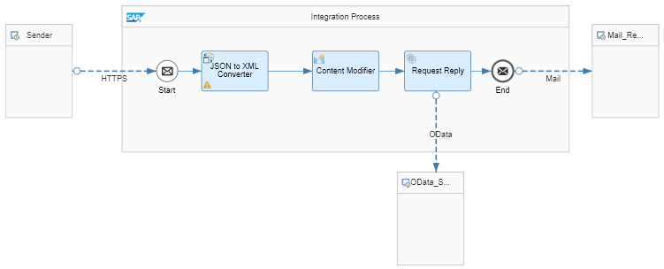

<!-- loioccdb189ad99a4db0908150c799cbe9e3 -->

# Sender-Initiated Scenario \(with HTTPS Sender Adapter\)

Create a simple integration scenario that is initiated by a sender \(using the HTTPS sender adapter\).

With the following steps, you can easily modify and extend the previously built integration flow with the email receiver \(*Timer-Initiated Scenario with a Mail Receiver*\).

The figure shows the integration flow model that you get as a result of this exercise.

In the modified integration flow, an HTTP client instead of a Timer event triggers message processing.

Furthermore \(to simplify the design\), we have merged the steps processed by two different Content Modifier steps in the previously built integration flow into one Content Modifier step.

> ### Note:  
> As a prerequisite to execute this integration flow in the Cloud Foundry environment, you need to authorize the sender system \(HTTP client\) to call the integration flow endpoint. For that purpose, you create a service instance on SAP BTP and generate service key credentials \(which can then be used by the HTTP client to call the integration flow endpoint\).

This is how the integration flow processes the message at runtime:

1.  The HTTP client \(represented by the Sender shape\) sends an HTTP request to SAP Cloud Integration through an HTTPS sender channel. The HTTPS request body, which is in JavaScript Object Notation \(JSON\) format, contains a product identifier.

2.  The JSON-to-XML converter transforms the request body into XML format \(which can be processed in the following step, the Content Modifier\).

3.  The Content Modifier creates a message header \(which we also call `productIdentifier`\) and writes the actual value of the `productIdentifier` element into it. This header is used in the subsequent step.

    In this exercise, you use **one** Content Modifier to create the header and to write the message body.

4.  The Request Reply step passes the message to an external data source and retrieves data \(about orders\) from there.

    The external data source supports the Open DataProtocol \(OData\). For our scenario, we use the ESPM WebShop, which is based on the Enterprise Sales and Procurement Model \(ESPM\) provided by SAP.

5.  An OData receiver channel is used for the connection to the OData source. To query for exactly one product \(for the product identifier provided with the inbound message\), the header that was created in the preceding Content Modifier is used.

6.  The OData API provides the details of one specific product, which is identified by the actual value of the `productIdentifier` field \(provided with the inbound HTTP request\).

7.  Finally, the result of the request is forwarded to an e-mail account using the Mail receiver adapter \(the e-mail server is represented by the right `Mail …` shape in the integration flow model\).

When you have finished the integration flow design, you can send the message through the HTTP client.

**Related Information**  

[Timer-Initiated Scenario with a Mail Receiver](timer-initiated-scenario-with-a-mail-receiver-bfee17e.md "Create a simple integration scenario that is initiated by a timer, retrieves data from an external source, and sends the result to an e-mail account (as the receiver system).")

[Authorize the HTTP Client to Call the Integration Flow Endpoint, Cloud Foundry Environment](authorize-the-http-client-to-call-the-integration-flow-endpoint-cloud-foundry-environment-7ac1d3a.md "You perform these steps to authorize the sender (HTTP client) to call the SAP Cloud Integration integration flow endpoint.")

[Create the HTTPS Sender Channel](create-the-https-sender-channel-bd53c6e.md "Add an HTTPS sender channel to enable the integration flow to receive HTTP requests.")

[Add the JSON to XML Converter](add-the-json-to-xml-converter-2c49c10.md "Add a JSON-to-XML converter to convert the HTTP request, which is in JavaScript Object Notation (JSON) format, to XML for further processing.")

 <?sap-ot O2O class="- topic/link " href="1399da491e7946999ead9566ae751311.xml" text="" desc="" xtrc="link:5" xtrf="file:/home/builder/src/dita-all/cdo1688560638547/loio3268cb35959d4b368fb49de861bfe8a1_en-US/src/content/localization/en-us/ccdb189ad99a4db0908150c799cbe9e3.xml" ?> 

 <?sap-ot O2O class="- topic/link " href="b60b009577f54f7eb56b457c16b25b26.xml" text="" desc="" xtrc="link:6" xtrf="file:/home/builder/src/dita-all/cdo1688560638547/loio3268cb35959d4b368fb49de861bfe8a1_en-US/src/content/localization/en-us/ccdb189ad99a4db0908150c799cbe9e3.xml" ?> 

 <?sap-ot O2O class="- topic/link " href="b08ee602f6954b2eb3cfd111f9a4d367.xml" text="" desc="" xtrc="link:7" xtrf="file:/home/builder/src/dita-all/cdo1688560638547/loio3268cb35959d4b368fb49de861bfe8a1_en-US/src/content/localization/en-us/ccdb189ad99a4db0908150c799cbe9e3.xml" ?> 

[Create the Mail Receiver Channel](create-the-mail-receiver-channel-a6966fd.md "Add a Mail receiver channel to enable the integration flow to send messages to an e-mail account.")

[Send the HTTP Request and Process the Integration Flow](send-the-http-request-and-process-the-integration-flow-f08cca6.md "Set up an HTTP client using Postman and send the HTTP request.")

