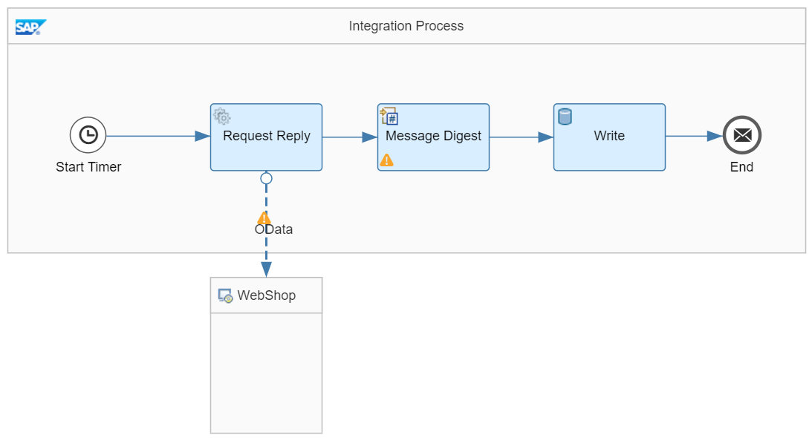

<!-- loio8b5a7cefafd34ddeaee2827f4df0acde -->

# Simple Integration Flow Using a Message Digest Step

You can use the Message Digest step to simply check if a message has been changed without checking the payload.

The following, Timer-initiated integration flow reads customer reviews from the WebShop application, calculates a digest out of the response, and finally stores the message as data store. The data store Entry ID is given by the value of the message digest header.

After the first message processing run, you can add an own review to the WebShop and run the integration flow again. As the response from the WebShop is now different than during the first message processing run, another digest is calculated which results in a new data store entry. This scenario shows a simple way to quickly check if a message \(in this case, the response from the WebShop\) has been changed without the need to check the payload itself.

> ### Note:  
> The external data source supports the Open DataProtocol \(OData\). For our scenario, we use the ESPM WebShop, which is based on the Enterprise Sales and Procurement Model \(ESPM\) provided by SAP.

After the integration flow has been triggered by the *Timer* step, the *Request Reply* step calls the WebShop using the OData V2 receiver adapter.

The OData V2 receiver adapter is configured in the following way:

<table>
<tr>
<td valign="top">

*Address* 

</td>
<td valign="top">

`https://refapp-espm-ui-cf.cfapps.eu10.hana.ondemand.com/espm-cloud-web/espm.svc/` 

</td>
</tr>
<tr>
<td valign="top">

*Resource Path* 

</td>
<td valign="top">

`CustomerReviews` 

</td>
</tr>
<tr>
<td valign="top">

*Query Options* 

</td>
<td valign="top">

`$select=CustomerReviewId,Comment,CreationDate,FirstName,LastName,ProductId,Rating` 

</td>
</tr>
</table>

For more information on how to create an OData V2 receiver channel, check out [Variant: Timer-Initiated Scenario with External Data Source and Receiver](variant-timer-initiated-scenario-with-external-data-source-and-receiver-7e766dd.md).

For the *Message Digest* step, you can leave the default parameters. That means, the digest is calculated out of the complete payload. Note that you like to check if the response from the WebShop has been changed between two message processing runs. Therefore, it makes sense to calculate a digest from the complete response payload.

If you keep the default settings, the message digest \(calculated from the payload\) is stored in the header `SAPMessageDigest`.

A subsequent Data Store *Write* step is configured in the following way:

<table>
<tr>
<td valign="top">

*Data Store Name* 

</td>
<td valign="top">

`CustomerReviews` 

</td>
</tr>
<tr>
<td valign="top">

*Entry ID* 

</td>
<td valign="top">

`${header.SAPMessageDigest}` 

</td>
</tr>
<tr>
<td valign="top">

*Overwrite Existing Message.* 

</td>
<td valign="top">

Selected

</td>
</tr>
</table>

For more information on how to create a Data Store Write step, check out [Define Data Store Write Operations](define-data-store-write-operations-46260ee.md).

The other settings can be left as predefined.

Run the integration flow a first time by deploying it. After this step, you find a data store entry \(using the *Monitor* application and checking the *Data Stores* tile under *Manage Stores*\). The *Entry ID* value is given by the message digest, for example:

`ZEB1AA5ZC2iLxDTP9I4kUAUVPG4=`

To initiate a situation that with the next processing of the integration flow you get another response from the WebShop, add a new customer review. Go to the WebShop frontend by opening the following page:

[https://refapp-espm-ui-cf.cfapps.eu10.hana.ondemand.com/webshop/index.html](https://refapp-espm-ui-cf.cfapps.eu10.hana.ondemand.com/webshop/index.html)

After you've added a customer review \(using any fictitious name\), deploy the integration flow again. As a result, you get a new data store entry \(in the same data store\) with a different entry ID than the previous entry. That way, you can easily find out that the message payload received from the WebShop has been changed since the last message processing run \(as it now contains a new customer review\).

