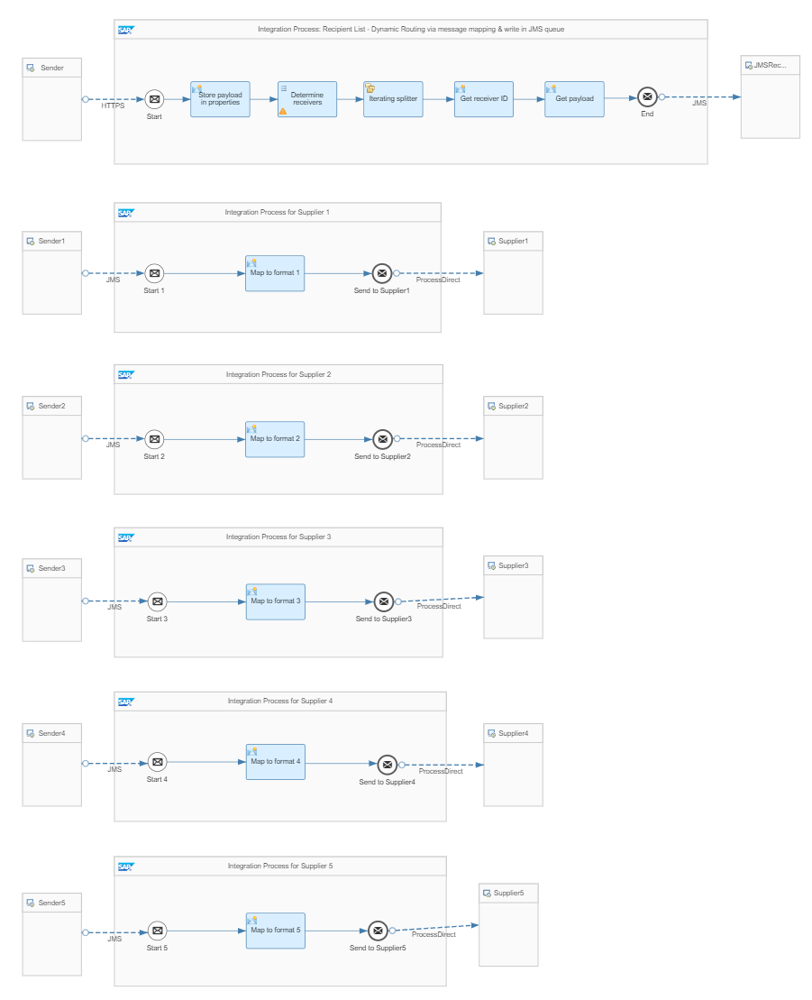

<!-- loio27c247e016184cee97581fbaa53359f7 -->

# Variant: Dynamic Routing Using JMS Message Queues

In the [Variant: Dynamic Routing](variant-dynamic-routing-d241c77.md) variant of the recipient list pattern, a message mapping is used to determine the list of receivers. The same mapping mechanism is used in the current variant as well. While we used the Process Direct adapter for the receiver specific delivery in the dynamic routing variant, in the current variant, we will achieve the same using a JMS queue. In this case, two integration flows / processes will be used: one for writing the message into the queue, and one for reading and processing it.

> ### Note:  
> Advantages of JMS queues:
> 
> -   By using a JMS queue as a temporary message store, we can separate the delivery of the messages to their receivers so each message can be handled independently. If, for instance, the connection to one receiver is currently broken and hence the delivery of the message to this receiver fails, the delivery to the other receivers is not affected.
> 
> -   Another advantage of decoupling the message delivery from the receiver determination using JMS is, that in case of error situations, the monitoring and tracing is improved compared to the other two recipient list variants. As each delivery creates a separate log entry, it's easier to find out which receiver connection had an issue.

The model is specified in the *Pattern Recipient List - Dynamic Routing Using JMS* reference integration flow.

The integration process *Recipient List - Dynamic Routing via message mapping & write in JMS queue* is defined as follows.

Since the incoming payload is overwritten in the message mapping, it first has to be saved for later by storing it in an exchange property. This task is performed by a Content Modifier that creates an exchange property \(called *payload*\). Its value is given by the expression `${in.body}`.

The Message Mapping processes the message in the following way:

-   The list of receivers is determined based on the *Category*. For demo purposes, a custom-mapping function `getReceiverList` is provided that has hard-coded routing rules, as previously described. The output of the function is a result list containing the list of receivers that the message is to be sent to. The *Category* source field is mapped to the *Receiver* target field.

-   Similarly, the*Category* source field is mapped to the*Service* target field below the Receiver node. In addition, the standard function *splitByValue*is added to change the context of the mapping queue. After the mapping was performed, the `Service` field will hold the name of the receiver.

After the mapping step, an Iterating Splitter is added. This step splits up the message into as many messages as there are receivers. The *Expression Type* attribute is set to *XPath* and the following XPath expression is specified: `/ns2:Receivers/Receiver`. We unselect the*Parallel Processing* flag, so message processing is done sequentially, see below.

A Content Modifier stores the receiver name \(whose value is given by the*/Receiver/Service* expression\) in the *receiver* header. This header is later automatically stored together with the message in the JMS queue and hence is passed to the second integration process.

At this step, the payload still contains the message that was given by the message mapping and the Splitter. Therefore, it has to be replaced by the original message payload, which was saved at the beginning of the flow into a property. That's why we use the `${property.payload}` expression in another Content Modifier.

For the JMS receiver adapter, a dynamic queue name `${header.receiver}` is specified..

Within this splitter scenario, we'd like to guarantee data consistency across all receiver messages, and hence across the multiple JMS write operations. In case of an error while writing a message into the JMS queue, the other write operations should be rolled back. If the sender now resends the message after it received an error on the first call, it is ensured that no duplicate message is sent to any receiver. To achieve this, it’s important to set the Transaction Handling of the integration process to *Required for JMS*. The Iterating Splitter step however supports transaction handling only in case of sequential processing, so the *Parallel Processing* flag has to be unselected, see above.

Like in the dynamic routing variant, a separate integration flow is provided for each receiver, here, containing a JMS sender adapter. For demo purposes, the receiver-specific integration processes are modeled within the same integration flow.

For the address of the JMS sender adapter, the corresponding receiver name is entered; in our example: *DRJ\_Supplier\#* with \# from 1 through 5.

**Related Information**  

[General and Iterating Splitter](general-and-iterating-splitter-b49d088.md "The two splitter types General Splitter and Iterative Splitter behave differently in their handling of the enveloping elements of the input message.")

[Splitter with Multiple Receivers \(JMS Adapter Type\)](splitter-with-multiple-receivers-jms-adapter-type-fc2755c.md "")

