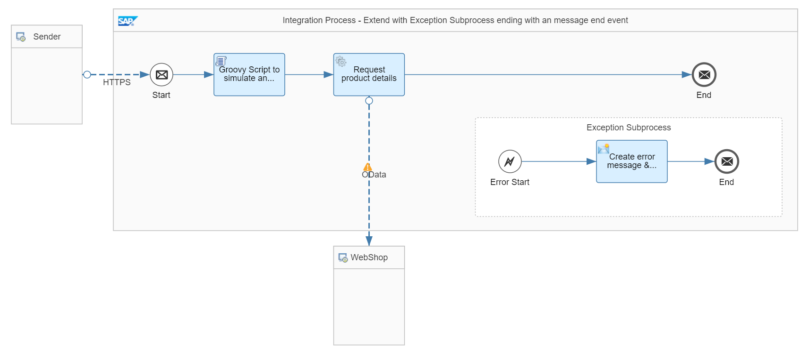

<!-- loio5f7b1c7c00f54339bc039ecd3c398a32 -->

# Variant: Exception Subprocess with End Event

Use this variant if you like to reply with a custom error message. In this case, the message is set to status Completed. You've the option to define a custom status that allows you to distinguish this error situation from successfully processed messages.

<a name="loio5f7b1c7c00f54339bc039ecd3c398a32__section_mkb_snx_ljb"/>

## Definition

For this variant, the integration flow is extended with an exception subprocess to reply with a custom error message to the sender application system once the message processing fails. The message however is in status *Completed*. Therefore, a custom-specific status is defined to be able to distinguish this kind of failed messages from successfully processed messages. Furthermore, you've the option to define a different http response code.

<a name="loio5f7b1c7c00f54339bc039ecd3c398a32__section_bf1_nfp_qnb"/>

## Implementation

To illustrate this rule, see the *Handle Errors - Extend With Exception Subprocess - End Event* integration flow.

To call this integration flow, provide a productId header together with the HTTP request \(from the HTTP client\) and give it any value for a product published in the WebShop catalog \(for example, the value HT-2001\).

Using the `error` header, you can control the processing of the integration flow.

-   If you want the integration flow to be successfully processed, set the `error` header to `false`.

-   If you want to simulate an error situation, set the `error` header to `true`.

The integration flow requests product details from the WebShop product catalog for this productId.

The OData adapter that receives the product details expects a data format as defined by the following query \(in the OData adapter\): `$select=ProductId,Category,LongDescription,Name,Weight,DimensionDepth,DimensionHeight,DimensionWidth,DimensionUnit&$filter=ProductId eq '${header.productId}'`.

In a groovy script right before the actual request-response step, a property path is set depending on the value of the error header. When triggering an error, the path is set in such a way that the OData call fails with an http 404 error.

If there's an error, the steps within the exception subprocess are carried out. The exception subprocess contains the *Create error message & custom status* Content Modifier that is configured as follows:

-   On the *Message Header* tab, the `CamelHttpResponseCode` is set to `202`.

-   On the *Exchange Property* tab, the `SAP_MessageProcessingLogCustomStatus` is set to `LowPrio`.

Furthermore, the following error message is created as specified in the *Message Body* tab: `"An error occured when calling the product catalog with productId equals ${header.productId}." The following error occurred: ${exception.message}`.

The dynamic expression `${header.productId}` takes the `productId` value as provided with the HTTP request header and writes it into the error message.

The dynamic expression `${exception.message}` gets the technical error information as provided by the integration framework.

To ensure that the message isn’t overwritten with the standard error message template, the exception subprocess ends with a message end event.

An example OData request is given in the Postman collection that comes with the integration package.

As mentioned already, to easily simulate an error situation, you can run the integration flow by setting the `error` header to `true`. You receive a response in your HTTP client as defined in the exception subprocess. In the message monitoring, the corresponding message processing log is in status *Completed*. Furthermore, in the log, the customer-specific status is displayed.

You can search for the message based on the customer-specific status using the OData API. To do that, select the *Use More Fields* link to display the additional *Custom Status* filter criteria. Optionally, you can use the custom status in the filter when retrieving the message processing logs via the OData API.

**Related Information**  

[Define Exception Subprocess](define-exception-subprocess-690e078.md "")

[Headers and Exchange Properties Provided by the Integration Framework](headers-and-exchange-properties-provided-by-the-integration-framework-d0fcb09.md "")

[Monitor Message Processing](../Operations/monitor-message-processing-314df3f.md "The message monitor provides an overview of the messages processed on a tenant and allows you to display the details for individual messages.")

[https://api.sap.com/api/MessageProcessingLogs/resource](https://api.sap.com/api/MessageProcessingLogs/resource)

