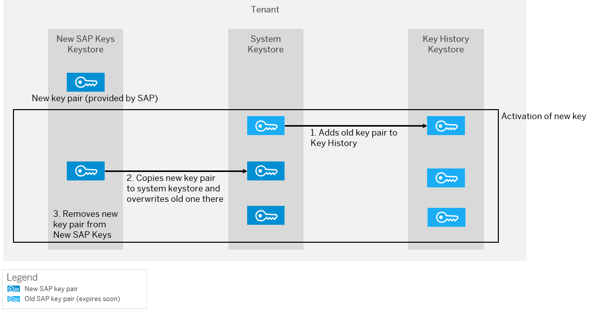

<!-- loioada2969e392d45a78efe7c66ce60369f -->

# Activating a New SAP Key Pair on the Tenant

### 

SAP Cloud Integration comes with a set of features that facilitate the tenant administrator's task of renewing keys provided by SAP on the tenant.

The following different keystore types enable the tenant administrator to renew keys in an efficient way:

-   System keystore

    This keystore is located in the `system.jks` file provided with the tenant and contains all keys that are actively used by the deployed integration flows.

-   New SAP Keys keystore

    This keystore contains keys already prepared by SAP before a key pair expires.

    As the key expiry date approaches, the tenant administrator can do the following:

    -   Download the new SAP keys from the KeyRenewal keystore to share them with the administrators of the connected back ends

    -   Activate the keys relevant for the tenant

-   SAP Key History keystore

    This keystore contains old \(expired\) keys.

    If required, the tenant administrator can restore a key from the Key History keystore and use it to replace a key in the system keystore.

During the activation of an SAP key, the system performs three steps, as shown in the following figure.

1.  The old key pair \(which expires soon\) is added by the system to the Key History keystore.

2.  The old key pair \(in the system.jks keystore\) is overwritten by the new key pair from the New SAP Keys keystore.

3.  In the New SAP Keys keystore, the new key pair is removed.

> ### Note:  
> To restore an old key pair, the tenant administrator can copy the key pair from the SAP Key History keystore to the New Keys keystore and activate it there.

