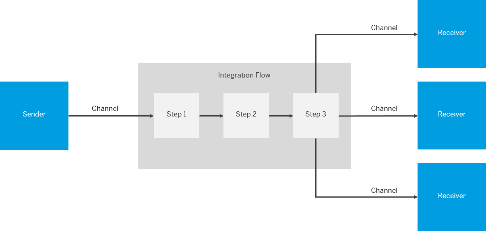

<!-- loio762289ab192a4a9a9230b1a56757bf19 -->

# Elements of a Cloud-Based Integration Scenario

In a cloud-based integration scenario, different customer components exchange messages with each other, and SAP Cloud Integration acts as an integration hub. Each customer component is securely connected to the Cloud Integration runtime.

In a nutshell, an integration scenario relies on a general landscape and component setup as illustrated in the following figure.

-   Secure connections between Cloud Integration and the involved remote components

    The Cloud Integration platform is fragmented into different tenants. A **tenant** represents the resources of the platform allocated to a customer and must be securely connected to the associated component in the customer landscape. The chosen transport protocol allows for specific transport-level security options \(for example, HTTPS\). On top of this, Cloud Integration supports various message-level security options, which allow you to digitally sign and encrypt the transferred data. The security setup relies on digital keys, which are stored in keystores; the creation and management of keystores is part of the security configuration of each component. The type of keystore and digital key used depends on the chosen security option. Therefore, we refer to these elements generally as **security artifacts**.

    In order to enable a tenant to securely communicate with a customer component, you have to configure the required security artifacts and deploy them on the tenant. On the other side of the communication, the customer component has to be configured accordingly by the responsible system administrator.

-   Integration knowledge specified and accessible to the runtime components

    During the operation of an integration scenario, Cloud Integration acts as an integration hub for the message exchange. To ensure a seamless process and data flow during the operation of the scenario, the Cloud Integration runtime needs to access the information on how messages are to be processed. This information is also referred to as *integration knowledge* and is contained in the **integration content** for each tenant. A key part of the integration content is the **integration flow**, which specifies step-by-step how a message is to be processed on a tenant. For example, a mapping step transforms the data contained in a message so that it can be processed by a receiver system, whereas a routing step defines one or more receivers of a message.

    During the design time of an integration scenario, you define the required integration flows. To *activate* an integration flow, you have to deploy it on the associated tenant.

## Integration Flows

An integration flow allows you to specify how a message is processed on a tenant.

The following figure provides a simplified and generalized representation of an integration flow.

**Related Information**  

 <?sap-ot O2O class="- topic/link " href="eb8a714909e54e3581efc58518e5bcfc.xml" text="" desc="" xtrc="link:1" xtrf="file:/home/builder/src/dita-all/cdo1688560638547/loio3268cb35959d4b368fb49de861bfe8a1_en-US/src/content/localization/en-us/762289ab192a4a9a9230b1a56757bf19.xml" ?> 

 <?sap-ot O2O class="- topic/link " href="f1094c33ce164b9ba6ee413855a0dee2.xml" text="" desc="" xtrc="link:2" xtrf="file:/home/builder/src/dita-all/cdo1688560638547/loio3268cb35959d4b368fb49de861bfe8a1_en-US/src/content/localization/en-us/762289ab192a4a9a9230b1a56757bf19.xml" ?> 

[Runtime in Detail](../Operations/runtime-in-detail-bdbc3f0.md "For different customers, separate resources (in terms of: memory, CPU, file system) of the cloud-based integration platform are allocated – although all customers share the same hardware. This concept is also referred to as tenant isolation.")

[Connectivity Options and Communication Security](connectivity-options-and-communication-security-aa8fa62.md "Various adapters allow you to connect the integration platform to remote systems using different kinds of technical communication protocols.")

